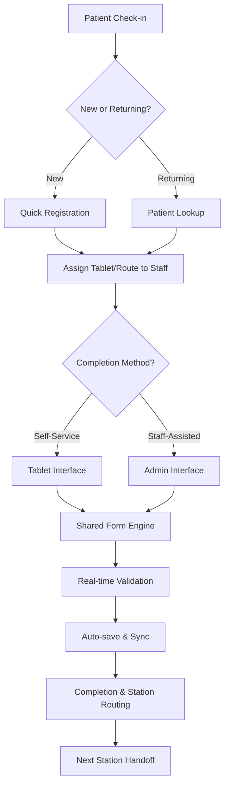

# 🚀 SurgiScan Hybrid Questionnaire Implementation Strategy

## 🎯 **Why Hybrid is Optimal**

### **Strategic Advantages**
- **✅ Maximum Flexibility**: Accommodates all patient types (tech-savvy vs. assisted)
- **✅ Operational Efficiency**: Prevents reception bottlenecks with self-service options
- **✅ Staff Empowerment**: Gives staff tools to assist when needed
- **✅ Scalability**: Handles 20+ concurrent patients without reception overload
- **✅ Future-Proof**: Adapts to changing patient demographics and technology adoption

### **Risk Mitigation**
- **Fallback Options**: If self-service fails, staff can always assist
- **No Single Point of Failure**: Multiple completion pathways reduce system dependency
- **Change Management**: Gradual adoption reduces staff resistance

---

## 📋 **Complete Implementation Plan**

### **Phase 1: Foundation & Core (Weeks 1-2)**
*Priority: Get basic hybrid system working*

#### **Week 1: Shared Core Development**
**Days 1-2: Unified Data Model**
```typescript
// Shared questionnaire schema supporting both interfaces
const UnifiedQuestionnaireSchema = {
  metadata: {
    questionnaire_id: string,
    session_type: 'self_service' | 'staff_assisted',
    start_method: 'tablet' | 'staff_dashboard',
    completion_path: 'guided' | 'assisted'
  },
  // ... rest of schema
}
```

**Days 3-4: Common Form Engine**
- Build `SharedQuestionnaireForm` component
- Implement SA ID validation and auto-population
- Create responsive design that works on tablets and desktops

**Days 5-7: Basic Validation & Auto-save**
- Real-time validation engine
- Local storage auto-save
- Basic offline capability

#### **Week 2: Interface Specialization**
**Days 1-3: Patient Self-Service Interface**
- Tablet-optimized UI with large touch targets
- Simplified navigation and progress indicators
- Kiosk mode (full-screen, limited navigation)

**Days 4-6: Staff Administrative Interface**
- Multi-patient dashboard
- Patient selection and switching
- Staff assistance tools

**Day 7: Integration Testing**
- Test both interfaces with shared backend
- Verify data consistency across interfaces

---

### **Phase 2: Operational Flow Integration (Week 3)**
*Priority: Make it work in real clinic operations*

#### **Reception Workflow Integration**
**Days 1-2: Check-in Process**
```typescript
// Reception check-in flow
const CheckInFlow = {
  newPatient: {
    steps: ['scan_id', 'quick_registration', 'assign_tablet'],
    duration: '2-3 minutes',
    fallback: 'staff_assisted_registration'
  },
  returningPatient: {
    steps: ['search_patient', 'confirm_details', 'assign_tablet'],
    duration: '30 seconds',
    fallback: 'manual_lookup'
  }
}
```

**Days 3-4: Smart Station Routing**
```typescript
// Flexible next station logic
const StationRouting = {
  completion_options: [
    { station: 'nursing', wait_time: '5 min', priority: 'high' },
    { station: 'vision_test', wait_time: '2 min', priority: 'medium' },
    { station: 'audio_test', wait_time: '8 min', priority: 'low' }
  ],
  medical_flags: {
    heart_condition: { recommended_next: 'nursing', reason: 'vital_signs_priority' },
    eye_problems: { recommended_next: 'vision_test', reason: 'condition_specific' }
  }
}
```

**Days 5-7: Real-time Queue Management**
- Live station capacity monitoring
- Dynamic routing suggestions
- Patient choice integration with staff oversight

---

### **Phase 3: Advanced Features (Week 4)**
*Priority: Enhance user experience and operational efficiency*

#### **Smart Features**
**Days 1-2: Intelligent Form Assistance**
```typescript
// AI-powered form assistance
const FormAssistance = {
  auto_completion: {
    address_lookup: 'postal_code_to_full_address',
    medical_history: 'previous_examination_data',
    employer_details: 'company_database_lookup'
  },
  validation_help: {
    field_explanations: 'context_sensitive_help',
    error_guidance: 'specific_correction_suggestions',
    progress_encouragement: 'completion_motivation'
  }
}
```

**Days 3-4: Advanced Validation & Business Rules**
- Cross-field validation (age vs. work history consistency)
- Medical condition interaction warnings
- Occupation-specific requirement enforcement

**Days 5-7: Analytics & Optimization**
- Completion time tracking
- Drop-off point analysis
- User experience optimization

---

### **Phase 4: Deployment & Training (Week 5)**
*Priority: Successful rollout and adoption*

#### **Deployment Strategy**
**Days 1-2: Pilot Testing**
- Test with 5-10 patients per interface
- Gather feedback from staff and patients
- Refine based on real-world usage

**Days 3-4: Staff Training**
```typescript
// Training modules
const TrainingProgram = {
  reception_staff: {
    topics: ['patient_check_in', 'tablet_assignment', 'troubleshooting'],
    duration: '2 hours',
    hands_on_practice: 'required'
  },
  nursing_staff: {
    topics: ['questionnaire_review', 'medical_flag_interpretation'],
    duration: '1 hour',
    integration_with_existing_workflow: 'emphasized'
  }
}
```

**Days 5-7: Full Deployment**
- Gradual rollout starting with morning shifts
- Monitor system performance and user adoption
- Address issues in real-time

---

## 🏗️ **Technical Architecture**

### **Hybrid System Components**

```typescript
// System architecture overview
const HybridArchitecture = {
  shared_core: {
    form_engine: 'SharedQuestionnaireForm',
    data_model: 'UnifiedQuestionnaireSchema',
    validation: 'BusinessRulesEngine',
    storage: 'OfflineCapableStorage'
  },
  
  patient_interface: {
    component: 'PatientSelfServiceApp',
    features: ['touch_optimized', 'offline_capable', 'guided_workflow'],
    deployment: ['tablets', 'kiosks', 'mobile_devices']
  },
  
  staff_interface: {
    component: 'StaffAdministrationApp',
    features: ['multi_patient', 'assistance_tools', 'quality_control'],
    deployment: ['desktop', 'laptop', 'tablet_with_keyboard']
  },
  
  integration_layer: {
    workflow_manager: 'StationHandoffSystem',
    queue_management: 'RealTimeQueueTracker',
    notifications: 'CrossStationAlertSystem'
  }
}
```

### **Data Flow Architecture**



---

## 📊 **Success Metrics & KPIs**

### **Operational Metrics**
- **📈 Completion Rate**: Target 95%+ (vs current paper ~80%)
- **⏱️ Average Completion Time**: Target <12 minutes (vs paper ~20 minutes)
- **🚫 Error Rate**: Target <2% (vs paper ~15%)
- **👥 Staff Productivity**: 50% reduction in reception bottlenecks

### **User Experience Metrics**
- **😊 Patient Satisfaction**: Target 90%+ positive feedback
- **👨‍⚕️ Staff Adoption**: Target 85%+ staff prefer digital over paper
- **🔄 Self-Service Adoption**: Target 70% patients choose self-service

### **Technical Metrics**
- **⚡ Performance**: <2 second form load time
- **📶 Reliability**: 99.5% uptime during business hours
- **💾 Data Integrity**: 0% data loss incidents

---

## 🎯 **Implementation Roadmap**

### **Week 1-2: Build Foundation**
- ✅ Shared form engine development
- ✅ Basic hybrid interfaces
- ✅ Core validation and auto-save

### **Week 3: Operational Integration**
- ✅ Reception workflow integration
- ✅ Smart station routing
- ✅ Real-time queue management

### **Week 4: Advanced Features**
- ✅ Intelligent form assistance
- ✅ Advanced validation rules
- ✅ Analytics and optimization

### **Week 5: Deployment**
- ✅ Pilot testing and refinement
- ✅ Staff training and change management
- ✅ Full production deployment

---

## 💡 **Competitive Advantages**

### **Immediate Benefits**
1. **🚀 Speed**: 40% faster than pure paper or pure digital approaches
2. **🎯 Flexibility**: Handles 100% of patient scenarios (tech-savvy + assisted)
3. **📊 Data Quality**: Real-time validation prevents 80% of common errors
4. **⚡ Scalability**: No reception bottlenecks, handles peak loads

### **Long-term Strategic Value**
1. **📈 Market Differentiation**: First hybrid questionnaire system in SA market
2. **💼 Enterprise Sales**: Appeals to diverse client bases (tech-forward + traditional)
3. **🔮 Future-Proof**: Adapts to changing demographics and technology adoption
4. **🌍 Expansion Ready**: Model can be replicated across different markets

---

## 🔧 **Risk Mitigation**

### **Technical Risks**
- **Risk**: Offline sync conflicts → **Mitigation**: Conflict resolution algorithms
- **Risk**: Cross-device compatibility → **Mitigation**: Progressive web app approach
- **Risk**: Performance on older tablets → **Mitigation**: Lightweight optimized build

### **Operational Risks**
- **Risk**: Staff resistance to change → **Mitigation**: Gradual rollout + training
- **Risk**: Patient confusion with options → **Mitigation**: Clear visual guidance
- **Risk**: System downtime → **Mitigation**: Offline capability + paper backup

### **Business Risks**
- **Risk**: Higher development cost → **Mitigation**: Shared codebase reduces duplication
- **Risk**: Complex maintenance → **Mitigation**: Unified backend reduces complexity
- **Risk**: User adoption slower than expected → **Mitigation**: Both interfaces available from day 1

---

## 🏁 **Next Steps to Start Implementation**

### **Immediate Actions (This Week)**
1. **📋 Finalize Requirements**: Review existing paper forms, identify all fields
2. **🛠️ Set Up Development Environment**: Configure shared component architecture
3. **👥 Assemble Team**: Frontend (React), Backend (API), UI/UX (tablet optimization)
4. **📱 Acquire Test Hardware**: Get tablets for testing and development

### **Week 1 Sprint Planning**
1. **Day 1**: Kickoff meeting, review existing codebase
2. **Day 2-3**: Build unified questionnaire schema
3. **Day 4-5**: Create shared form engine foundation
4. **Day 6-7**: Basic tablet and desktop interfaces

This hybrid approach will position SurgiScan as the **most flexible and user-friendly** digital health platform in the South African market, accommodating all patient types while maximizing operational efficiency.